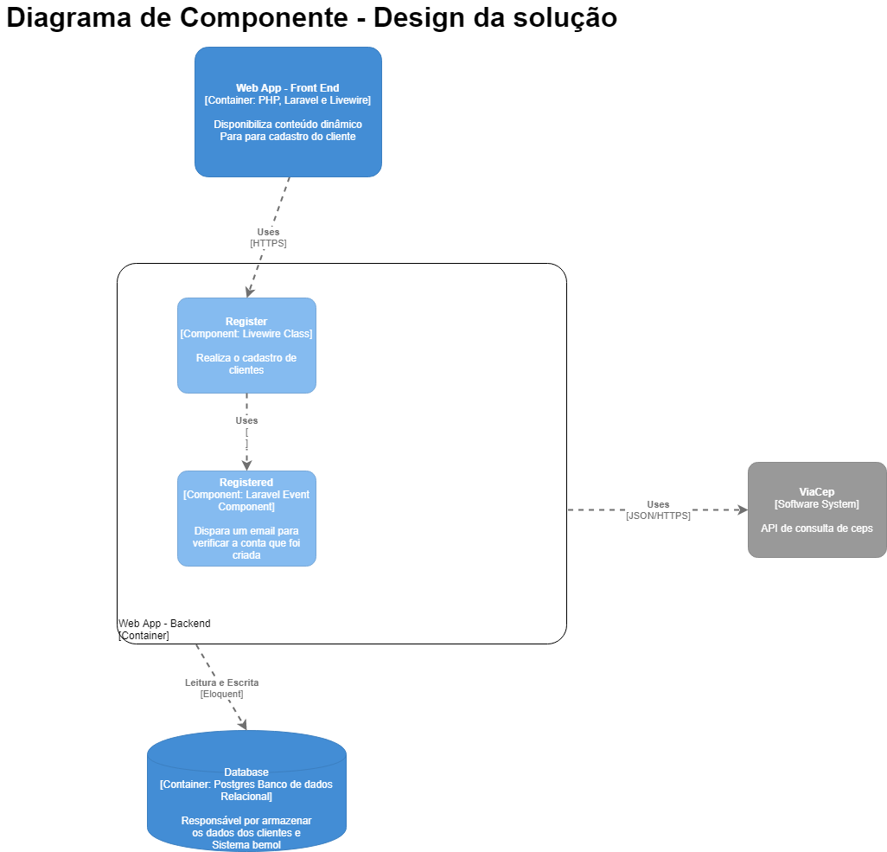

## Tubefy

Tubefy é um projeto demo que resolve o defasio proposto pela Bemol Digital. 
Sua função é cadastrar um usuário e criar o seu endereço a partir do CEP que
é informado. Caso o CEP seja inválido uma notificação é exibida.


## Requisitos

Para rodar o tubefy você irá precisar de um ambiente PHP na sua máquina.

- [PHP ^7.3](https://www.php.net/downloads.php).
- [Composer](https://getcomposer.org/download/)
- [Node.js](https://nodejs.org/en/).
- [Mysql](https://www.mysql.com/downloads/) ou [PostgresSql](https://www.postgresql.org/download/)

Uma alternativa recomendada é utilizar o ambiente [Laragon](https://laragon.org/download/) que já possui o Apache 2.4, Nginx, MySQL 5.7, PHP 7.2, Redis, Memcached, Node.js 11, npm, yarn, git. 

Caso você decida utilizar o laragon, utilize esse [tutorial](https://forum.laragon.org/topic/166/tutorial-how-to-add-another-php-version-php-7-4-php-8-0-updated/63) para atualizar a versão do PHP

Pacotes utilizados

 - [Livewire](https://github.com/livewire/livewire) Cria componentes dinâmicos e reativos com PHP !
 - [Breeze](https://github.com/laravel/breeze) Implementa autenticação com [Tailwind.css](https://tailwindcss.com/)
 - [InputMask.js](https://github.com/RobinHerbots/Inputmask) Cria máscaras com JavaScript

 ## Instalação
   
 - Clone o [repositório](https://github.com/iassBR/tubefy) na pasta desejada com o seguinte comando ```git clone https://github.com/iassBR/tubefy.git``` 
 - Caso esteja usando o laragon clone o repositório para ```.../laragon/www```
 - Abra a pasta do projeto e no terminal de comandos execute  ```composer install```
 - Depois, no terminal execute ```npm install && npm run dev```
 - No terminal de comandos copie o arquivo .env ```cp .env.example .env```
 - Edite no arquivo .env as informações necessárias para acessar o banco de dados conforme o modelo de exemplo que está contido no mesmo.
 - Após isso execute no terminal
    ```
        php artisan migrate
        php artisan key:generate
        php artisan serve 
    ```
 - Caso você esteja usando o Laragon, basta acessar ```http://tubefy.test``` no navegador ;).
 - Caso contrário, acesse ```http://localhost:8000/```

## Diagramas C4

Aqui constam os diagramas do desafio.

### Diagrama de Container - Visão Arquitetural


### Diagrama de Componente - Visão do App


### Questionário


